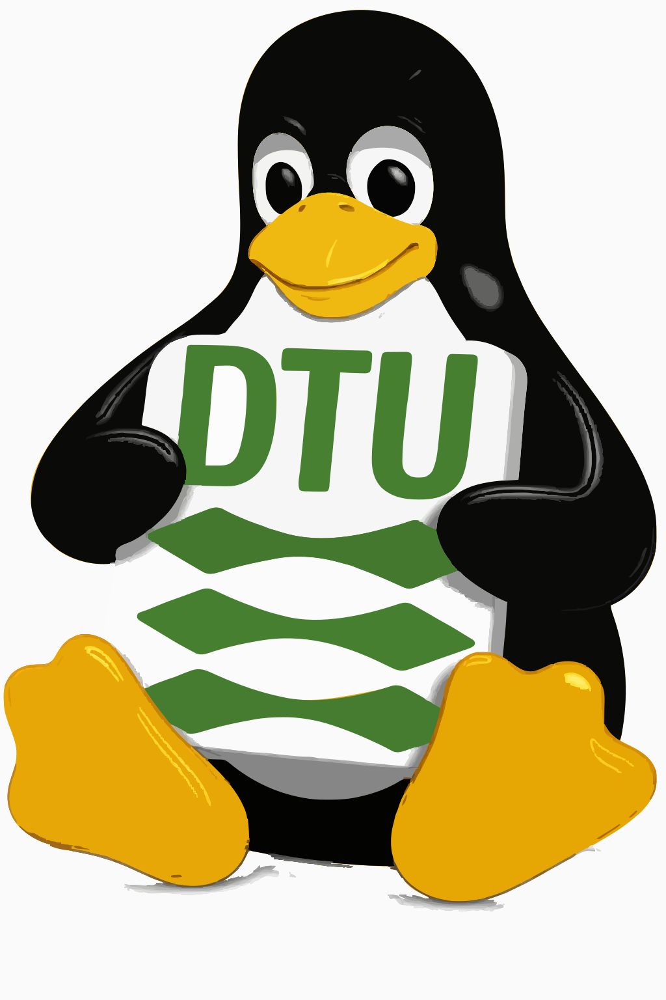

# DTU Linux Setup

Et grafisk opsætningsværktøj der bringer DTU's Linux-arbejdsstationer i drift med ét klik per opgave.
Værktøjet understøtter to institut-profiler — **Sustain** og **AIT** — og kører på både **Ubuntu 24.04 LTS** og **openSUSE Tumbleweed**.

<p align="center">
  
</p>

---

## Hvad er det?

DTU Linux Setup samler alle de manuelle trin en IT-administrator (eller selvbetjenende slutbruger) ellers skulle huske at gøre i hånden, når en ny Linux-maskine sættes op til DTU-miljøet:

- Joine maskinen til **WIN.DTU.DK** Active Directory
- Mounte instituttets netværksdrev (Q+P for Sustain, O+M for AIT)
- Opsætte printere — enten klassisk **FollowMe** (Sustain) eller en **WebPrint webapp** der peger på `webprint.dtu.dk` (AIT)
- Tilslutte **DTUSecure** WiFi automatisk via WPA2-Enterprise/PEAP
- Installere **Microsoft Defender for Endpoint** + onboarding
- Konfigurere **PolicyKit** så domænebrugere må håndtere USB, WiFi og pakker uden adgangskode
- Installere **Flatpak**, **Snap** og **Cisco Secure Client VPN** efter en redigerbar pakkeliste
- Sætte **xrdp** (Remote Desktop) op
- Onboarde maskinen til Ansible-flåden via en `sus-root` service-konto
- Sikre at brugerens **Skrivebord, Dokumenter og Billeder** synkroniseres til netværksdrevet — ingen symlinks, kun rsync ved login og hver time
- Vise en **first-login welcome-dialog** for nye domænebrugere
- Diagnosticere fejl med en indbygget **error dialog** (heuristisk klassificering + "Copy Error and Fix"-knap)

Alt sker via en PyQt6-GUI med et grid af knapper. Hver knap kører ét bash-script under root via `pkexec`, og live-output streames tilbage til log-vinduet.

---

## Indhold

- [Profiler: Sustain vs AIT](#profiler-sustain-vs-ait)
- [Moduler](#moduler)
- [Installation](#installation)
- [Brug](#brug)
- [Modul-detaljer](#modul-detaljer)
- [Software-styring](#software-styring)
- [Arkitektur](#arkitektur)
- [Filstruktur](#filstruktur)
- [Udvikling](#udvikling)
- [Fejlfinding](#fejlfinding)

---

## Profiler: Sustain vs AIT

Ved første start (eller via dropdown'en i toppen af GUI'en) vælges den institut-profil der matcher maskinen. Profilen skrives til `/etc/dtu-setup/department` og styrer hvordan flere moduler opfører sig:

| Aspekt | **Sustain** | **AIT** |
|---|---|---|
| Netværksdrev | `Q-Drev` + `P-Drev` (`konfigureret via site.conf`) | `O-Drev` + `M-Drev` (`konfigureret via site.confUsers<n>/<initialer>`) |
| Printer | FollowMe via CUPS (`konfigureret via site.conf`) | **WebPrint webapp** — chromium `--app=https://webprint.dtu.dk` |
| Drev-konfiguration | Hardkodet i scriptet | Læses fra `/etc/dtu-setup/drives.conf` |
| Polkit/IT-admin | Domænebrugere får standard-rettigheder | Samme |
| Resterende moduler | Identiske | Identiske |

**Bemærk om AIT-brugermapper:** Brugere ligger fordelt over 9 mapper på `\\<fileserver>\Users\Users0-9\<initialer>` (f.eks. `\\<fileserver>\Users\Users7\mpark`). Den korrekte sti opdages automatisk under drev-mountet.

---

## Moduler

13 moduler i alt. Alle kræver root og kører via `pkexec`.

| # | Modul | Hvad det gør | Ubuntu | openSUSE |
|---|---|---|:-:|:-:|
| 1 | **Domain Join** | Join WIN.DTU.DK (realmd + SSSD + mkhomedir) | ✅ | ✅ |
| 2 | **Network Drives** | Mount institut-drev via CIFS (Q+P eller O+M) | ✅ | ✅ |
| 3 | **Microsoft Defender** | Defender for Endpoint install + onboarding | ✅ | ✅* |
| 4 | **PolicyKit** | Domæne­bruger­rettigheder (USB, WiFi, pakker) | ✅ | ✅ |
| 5 | **Printers** | FollowMe (Sustain) eller WebPrint webapp (AIT) | ✅ | ✅ |
| 6 | **DTUSecure WiFi** | WPA2-Enterprise auto-connect (PEAP/MSCHAPv2) | ✅ | ✅ |
| 7 | **Software** | Flatpaks, Snaps & Cisco Secure Client VPN | ✅ | ✅ |
| 8 | **Auto-mount** | USB automount + udev-regler (ingen symlinks) | ✅ | ✅ |
| 9 | **Sync Home Dirs** | Backup af Desktop/Documents/Pictures til netværksdrev (rsync, login + timer) | ✅ | ✅ |
| 10 | **RDP (xrdp)** | Remote Desktop med KDE Plasma over xrdp | ✅ | — |
| 11 | **Ansible Onboarding** | `sus-root` service-konto + SSH-nøgle + sudo | ✅ | ✅ |
| 12 | **First-Login Setup** | Deploy welcome-dialog der vises ved nye domænebrugeres første login | ✅ | ✅ |
| 13 | **Reset Test User** | (skjult) Fjern domain-user state + home-dir til gen-test | ✅ | ✅ |

\* openSUSE Tumbleweed bruger SLES 15-pakker — ikke officielt understøttet af Microsoft.

---

## Installation

### Forudsætninger

|                | Ubuntu 24.04        | openSUSE Tumbleweed |
|----------------|---------------------|---------------------|
| **Desktop**    | `kde-standard`      | (KDE preinstalled)  |
| **Python**     | `python3` (≥ 3.10)  | `python3` (≥ 3.10)  |
| **GUI**        | `python3-pyqt6`     | `python3-qt6`       |
| **Privilegier**| `policykit-1`       | `polkit`            |
| **Shell**      | `bash`              | `bash`              |

### Ubuntu 24.04

```bash
sudo apt update
sudo apt install kde-standard python3 python3-pyqt6 policykit-1

# Direkte
sudo make install

# Eller byg DEB-pakke (anbefalet)
make deb
sudo dpkg -i dtu-sustain-setup_1.0.0_all.deb
```

### openSUSE Tumbleweed

```bash
sudo zypper install python3-qt6 polkit

# Direkte
sudo make install

# Eller byg RPM-pakke
make rpm
sudo zypper install ~/rpmbuild/RPMS/noarch/dtu-sustain-setup-1.0.0-1.noarch.rpm
```

### Afinstallation

```bash
sudo make uninstall
# eller
sudo dpkg -r dtu-sustain-setup       # Ubuntu
sudo zypper remove dtu-sustain-setup # openSUSE
```

---

## Brug

### Start programmet

**Fra applikationsmenuen:** Find **DTU Linux Setup** under *Indstillinger* (Settings). Ikonet er synligt for alle brugere, inklusiv domænebrugere.

**Fra terminalen:**
```bash
dtu-sustain-setup       # Installeret
make run                # Fra kildekode
```

### Hovedvinduet

```
┌──────────────────────────────────────────────────────────────────┐
│  🔴  DTU Linux Setup                  Department: [ Sustain ▼ ]  │
│  Detected: Ubuntu 24.04.1 LTS                                    │
│                                                                  │
│  ┌──────────────┐  ┌──────────────┐  ┌──────────────┐            │
│  │ Domain Join  │  │ Network      │  │ MS Defender  │            │
│  │ WIN.DTU.DK   │  │ Drives       │  │ Endpoint     │            │
│  └──────────────┘  └──────────────┘  └──────────────┘            │
│  ┌──────────────┐  ┌──────────────┐  ┌──────────────┐            │
│  │ PolicyKit    │  │ Printers     │  │ DTUSecure    │            │
│  │ Domain rights│  │ FollowMe/Web │  │ WiFi         │            │
│  └──────────────┘  └──────────────┘  └──────────────┘            │
│  ┌──────────────┐  ┌──────────────┐  ┌──────────────┐            │
│  │ Software     │  │ Auto-mount   │  │ Sync Home    │            │
│  │ Flatpak/Snap │  │ USB udev     │  │ Dirs         │            │
│  └──────────────┘  └──────────────┘  └──────────────┘            │
│  ┌──────────────┐  ┌──────────────┐  ┌──────────────┐            │
│  │ RDP (xrdp)   │  │ Ansible      │  │ First-Login  │            │
│  │              │  │ Onboarding   │  │ Setup        │            │
│  └──────────────┘  └──────────────┘  └──────────────┘            │
│                                                                  │
│  [ ▶  Run All Admin Modules ]                       [ Cancel ]   │
│                                                                  │
│  Output Log:                                                     │
│  ┌──────────────────────────────────────────────────────────────┐│
│  │ ▶ Running with elevated privileges: domain-join.sh           ││
│  │ === Domain Join ===                                          ││
│  │ ✅ Hostname set to DTU-DEPT-PC01                              ││
│  └──────────────────────────────────────────────────────────────┘│
└──────────────────────────────────────────────────────────────────┘
```

### Kør et enkelt modul

1. Vælg den korrekte **Department**-profil i toppen
2. Klik på modul-knappen
3. Udfyld eventuel dialog (credentials, hostname, etc.)
4. Godkend privilegieeskalering via PolicyKit
5. Følg fremgangen i **Output Log**
6. Knappen skifter farve: **grøn** = succes, **rød** = fejl

### Kør alle moduler

1. Klik **▶ Run All Admin Modules**
2. Indtast credentials i de dialoger der vises (DTU-bruger, hostname, Ansible-kode m.m.)
3. Brug **Cancel** for at stoppe køen

### Fejldialog

Når et modul fejler, åbnes en **Error Dialog** der:
- Heuristisk klassificerer fejlen (auth, Kerberos, SMB/CIFS, polkit, package, network, m.fl.) ud fra 56 mønstre
- Foreslår en konkret fix
- Tilbyder en **"Copy Error Message and Fix"**-knap der kopierer både fejlteksten og foreslået handling til clipboard

---

## Modul-detaljer

### 🌐 Domain Join

Joiner maskinen til `WIN.DTU.DK`.

**Input:** hostname + admin-brugernavn (f.eks. `adm-<username>`).

1. Sætter hostname
2. Installerer `realmd`, `sssd`, `sssd-ad`, `adcli`, `krb5-user`/`krb5-client`
3. Opdager domænet via DNS
4. Åbner terminal til interaktiv `realm join`
5. Konfigurerer SSSD: korte brugernavne, `/home/<user>` som home
6. Aktiverer `mkhomedir`

### 📁 Network Drives

CIFS-mount af institut-drev. Profilen styrer hvilke drev der mountes.

**Input:** DTU-brugernavn + adgangskode.

| Profil | Drev | Netværkssti | Lokal sti |
|---|---|---|---|
| Sustain | Q | `konfigureret via site.conf` | `/mnt/Qdrev` |
| Sustain | P | `konfigureret via site.conf<user>` | `/mnt/Personal` |
| AIT | O | (afdelingsspecifik, fra `drives.conf`) | `/mnt/Odrev` |
| AIT | M | `konfigureret via site.confUsers<n>/<initialer>` | `/mnt/Mdrev` |

> **openSUSE:** bruger Qumulo-host direkte (`konfigureret via site.conf`) for at omgå en kernel DFS-bug.

Drevene mountes via systemd automount — de aktiveres ved første adgang.

### 🛡️ Microsoft Defender

Tilføjer Microsofts repository, installerer `mdatp`, kører onboarding fra `konfigureret via site.conf` og aktiverer realtidsbeskyttelse + network protection.

### 🔑 PolicyKit

Domænebrugere får UDEN adgangskode lov til:

- 🔌 USB: mount/unmount/eject
- 📶 WiFi/VPN/netværk
- ⏻ Strøm: sluk/genstart/dvale
- 🖨️ CUPS: admin egne printjobs
- 🔵 Bluetooth
- 📦 Pakke-installation (apt/zypper) — hvor det er sikkert

### 🖨️ Printers

**Sustain (FollowMe):** Tilføjer `FollowMe-MFP-PCL` og `FollowMe-Plot-PS` mod `konfigureret via site.conf` med tilpasset `smbspool-auth` CUPS-backend.

**AIT (WebPrint):**
1. Installerer `dtuprint.png` til `/usr/share/pixmaps/dtu-webprint.png`
2. Sikrer at chromium er installeret (med fallback til Chrome/Edge/Brave/snap chromium/Firefox/`xdg-open`)
3. Skriver wrapper `/usr/local/bin/dtu-webprint` der starter `chromium --app=https://webprint.dtu.dk --class=DTU-WebPrint --user-data-dir=$HOME/.config/dtu-webprint`
4. Skriver `.desktop`-fil med `StartupWMClass=DTU-WebPrint` for korrekt taskbar-gruppering

Resultatet er en standalone webapp på skrivebordet — ingen browser-tabs, ingen URL-bar.

### 📶 DTUSecure WiFi

NetworkManager-konfiguration til DTU's WPA2-Enterprise (PEAP/MSCHAPv2) med auto-connect. Credentials gemmes i system-keyring.

**Input:** DTU-brugernavn + adgangskode.

### 💻 Software

Se [Software-styring](#software-styring) nedenfor.

### 🔁 Auto-mount

Opretter udev-regler for automatisk USB-mount samt understøttende polkit-regler. **Ingen symlinks** — alt mountpoint-baseret.

### 🔄 Sync Home Dirs

Erstatter den gamle OneDrive-symlink-løsning. Bruger rsync (offline-first) til at sikre at brugerens nøglemapper er synkroniseret til netværksdrevet.

**Komponenter:**
- `setup-sync-homedir.sh` — installerer service og PAM-hook
- `sync-homedir-login.sh` — kører ved hvert login
- `sync-homedir.sh` — daglig sync via systemd timer
- `systemd/sync-homedir.{service,timer}` — kører hver time

Synkroniserede mapper: `~/Desktop`, `~/Documents`, `~/Pictures`.

### 🖥️ RDP (xrdp) — kun Ubuntu

xrdp på port 3389/tcp med KDE Plasma X11-session, TLS-only, clipboard- og drive-redirection.

### ⚙️ Ansible Onboarding

Opretter `sus-root` service-konto (skjult fra loginskærm), deployer ed25519 SSH-nøgle og giver passwordless sudo.

**Input:** sus-root adgangskode (Bitwarden).

### 👤 First-Login Setup

Deployer `dtu-first-login.sh` + autostart-entry så nye domænebrugere får en velkomst-dialog ved første login (vejledning til drev, printere m.m.).

### 🧪 Reset Test User (skjult)

Til IT-test: fjerner en domænebrugers SSSD-cache, home-dir, keyring og NetworkManager-credentials så bruger-flowet kan testes igen.

---

## Software-styring

Software-modulet bruger en redigerbar konfigurationsfil i stedet for hardkodede pakker.

### `data/software.conf`

```ini
[flatpak]
com.microsoft.Edge
com.github.tchx84.Flatseal
org.flameshot.Flameshot
org.onlyoffice.desktopeditors
com.github.IsmaelMartinez.teams_for_linux
org.remmina.Remmina
us.zoom.Zoom
com.usebottles.bottles
io.github.alescdb.mailviewer

[snap]
office365webdesktop

[cisco]
cisco-secure-client
```

### Software-dialogen

Klik på **Software**-knappen for at åbne en dialog hvor du kan tilføje, redigere og fjerne pakker per sektion (Flatpak / Snap / Cisco), vælge Cisco-tarball via **Browse…**, og enten **Save** (kun gem) eller **Save & Install**.

### Cisco Secure Client

Installationen kører alle moduler i tarball'en i fast rækkefølge: `vpn → dart → fireamp → iseposture → nvm → ...`. NVM kan fejle på nyere kerner — det er en Cisco-begrænsning, ikke en fejl i scriptet.

> **Tip:** Læg `cisco-secure-client-linux64-*.tar.gz` i repo-roden, så finder Software-modulet den automatisk.

---

## Arkitektur

```
                    ┌──────────────────┐
                    │      Bruger      │
                    └────────┬─────────┘
                             │
                    ┌────────▼─────────┐
                    │  PyQt6 GUI       │
                    │  main_window.py  │
                    │  ├─ Department   │
                    │  │  dropdown     │
                    │  ├─ Module grid  │
                    │  └─ Output log   │
                    └────────┬─────────┘
                             │
              ┌──────────────┼──────────────┐
              │              │              │
     ┌────────▼─────┐  ┌─────▼──────┐  ┌────▼──────────┐
     │ input_dialog │  │ModuleRunner│  │ error_dialog  │
     │  (Qt forms)  │  │ QProcess + │  │ heuristic     │
     │              │  │ pkexec     │  │ classifier    │
     └──────────────┘  └─────┬──────┘  └───────────────┘
                             │
                ┌────────────┼────────────┐
                │                         │
       ┌────────▼────────┐      ┌────────▼─────────┐
       │ scripts/ubuntu/ │      │ scripts/opensuse/│
       │ + scripts/      │      │ + scripts/       │
       │   (common)      │      │   (common)       │
       └────────┬────────┘      └────────┬─────────┘
                └────────────┬────────────┘
                    ┌────────▼─────────┐
                    │ scripts/common.sh│
                    │ (banner/ok/warn) │
                    └──────────────────┘
```

**Dataflow:**

1. GUI samler input via Qt-dialoger
2. `ModuleRunner` skriver en wrapper der eksporterer `DTU_*` env vars
3. `pkexec` eskalerer scriptet til root via PolicyKit
4. Bash-scriptet udfører den egentlige opsætning og streamer stdout/stderr
5. Hvis exit-koden er ≠ 0 åbnes `ErrorDialog` med diagnose

**Environment-variabler:**

| Variabel | Bruges af |
|---|---|
| `DTU_DEPARTMENT` | Alle (sustain\|ait) |
| `DTU_USERNAME`, `DTU_PASSWORD` | Network Drives, FollowMe, WiFi |
| `DTU_HOSTNAME`, `DTU_ADMIN_USERNAME` | Domain Join |
| `DTU_ANSIBLE_PASSWORD` | Ansible Onboarding |
| `DTU_SOFTWARE_CONF`, `DTU_CISCO_TARBALL` | Software |
| `DTU_TARGET_USER` | Reset Test User |

---

## Filstruktur

```
DTU-Umbrella/
├── src/dtu_sustain_setup/        # PyQt6 GUI
│   ├── __init__.py
│   ├── __main__.py               # QApplication entry point
│   ├── main_window.py            # Modul-grid + department dropdown
│   ├── module_runner.py          # QProcess + pkexec wrapper
│   ├── input_dialog.py           # Credential/username/software dialogs
│   ├── error_dialog.py           # Heuristisk fejldiagnose (56 mønstre)
│   └── distro.py                 # /etc/os-release detektion
├── scripts/
│   ├── common.sh                 # Delte bash-helpers
│   ├── dtu-first-login.sh        # Welcome-dialog for nye brugere
│   ├── setup-sync-homedir.sh     # Installerer sync-service
│   ├── sync-homedir.sh           # Daglig rsync (timer)
│   ├── sync-homedir-login.sh     # Login-tids rsync (PAM)
│   ├── reset-test-user.sh        # Genbrug test-bruger
│   ├── install-software-manual.sh
│   ├── systemd/
│   │   ├── sync-homedir.service
│   │   └── sync-homedir.timer
│   ├── ubuntu/                   # Ubuntu modul-scripts
│   │   ├── domain-join.sh
│   │   ├── qdrive.sh
│   │   ├── defender.sh
│   │   ├── polkit.sh
│   │   ├── followme.sh           # Sustain CUPS / AIT WebPrint
│   │   ├── automount.sh
│   │   ├── software.sh
│   │   ├── rdp.sh
│   │   ├── ansible.sh
│   │   └── first-login-deploy.sh
│   └── opensuse/                 # openSUSE modul-scripts
│       ├── domain-join.sh
│       ├── qdrive.sh
│       ├── defender.sh
│       ├── polkit.sh
│       ├── followme.sh
│       ├── automount.sh
│       └── software.sh
├── data/
│   ├── dtu-sustain-setup.desktop # XDG desktop entry
│   ├── dtu-sustain-setup.svg     # App-ikon
│   ├── dtuprint.png              # Ikon til AIT WebPrint webapp
│   ├── dk.dtu.sustain.setup.policy
│   └── software.conf             # Pakkeliste
├── bin/
│   └── dtu-sustain-setup         # Launcher
├── packaging/
│   ├── debian/                   # DEB-pakke
│   └── rpm/                      # RPM spec
├── docs/GUIDE.md                 # Brugerguide
├── Makefile                      # build / install / deb / rpm
├── pyproject.toml
└── README.md
```

---

## Udvikling

### Kør fra kildekode

```bash
PYTHONPATH=src python3 -m dtu_sustain_setup
# eller
make run
```

### Byg pakker

```bash
make deb   # Ubuntu
make rpm   # openSUSE
```

### Tilføj et nyt modul

1. **Skriv scriptet:** `scripts/ubuntu/mit-modul.sh` (og evt. `scripts/opensuse/mit-modul.sh`)
   - Start med `source "${SCRIPT_DIR}/../common.sh"` og `need_root`
   - Brug `banner`, `ok`, `warn`, `fail` helpers
   - Branch på `$DTU_DEPARTMENT` hvis adfærden afhænger af profilen
2. **Registrer i GUI:** Tilføj en `ModuleDef` til `MODULES`-listen i [`main_window.py`](src/dtu_sustain_setup/main_window.py)
3. **Vælg `input_type`:** `none`, `credentials`, `username`, `password`, `domain_join`, eller `software`
4. **(Valgfrit)** Tilføj nye fejlmønstre i [`error_dialog.py`](src/dtu_sustain_setup/error_dialog.py)

### Tilføj standard-software

Rediger [`data/software.conf`](data/software.conf) eller brug Software-dialogen.

---

## Fejlfinding

### Programmet starter ikke

```bash
python3 -c "from PyQt6.QtWidgets import QApplication; print('OK')"
which dtu-sustain-setup
```

### "pkexec not found"

```bash
sudo apt install policykit-1   # Ubuntu
sudo zypper install polkit     # openSUSE
```

### Modul fejler med "Script Missing"

```bash
cat /etc/os-release
```

Programmet søger scripts i:
- Installeret: `/opt/dtu-sustain-setup/scripts/<ubuntu|opensuse>/`
- Development: `<repo>/scripts/<ubuntu|opensuse>/`

### Domain Join fejler

- Tjek DNS: `nslookup WIN.DTU.DK`
- Maskinen skal kunne nå DTU's domain controllers
- Brug en admin-konto med ret til at joine maskiner

### WebPrint webapp åbner i browser-tab i stedet for som standalone

Skift browser-prioritet i `/usr/local/bin/dtu-webprint`. Chromium-baserede browsere giver bedst webapp-oplevelse (`--app=`-flag). Firefox-fallbacken bruger separat profil + `--no-remote`.

### Sync Home Dirs synkroniserer ikke

```bash
systemctl status sync-homedir.timer
journalctl -u sync-homedir.service -n 50
```

Network Drives-modulet skal være kørt først.

### Cisco VPN installerer ikke

- Sørg for tarball er tilgængelig (vælg via **Browse…** eller læg i repo-roden)
- NVM-modulet fejler typisk på nyere kerner (Cisco-begrænsning)
- Tjek dependencies: `libxml2`, `linux-headers`, `gcc`, `make`

---

## Licens

MIT
