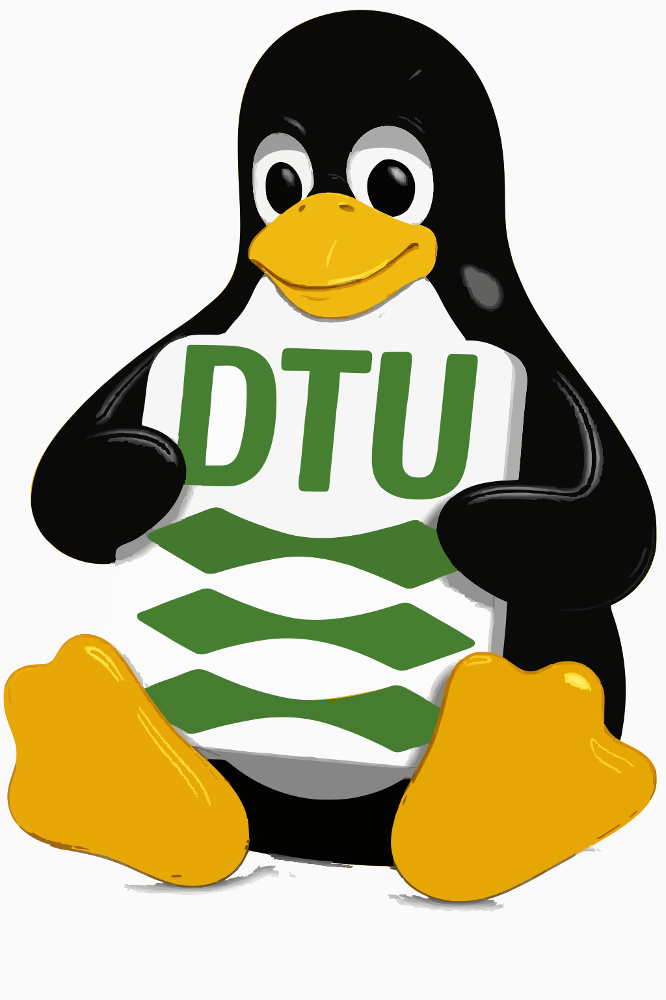

# DTU Linux Setup

Et grafisk opsætningsværktøj der bringer DTU's Linux-arbejdsstationer i drift med ét klik per opgave.

<p align="center">
  
</p>

> **Første gang du sætter en maskine op?**
> Se [docs/GUIDE.md](docs/GUIDE.md) for en komplet trin-for-trin installationsvejledning.

---

## Hvad er det?

DTU Linux Setup samler alle de manuelle trin en IT-administrator (eller selvbetjenende slutbruger) ellers skulle huske at gøre i hånden, når en ny Linux-maskine sættes op til DTU-miljøet:

- Joine maskinen til **WIN.DTU.DK** Active Directory
- Mounte instituttets netværksdrev (Q+P for Sustain, O+M for AIT)
- Opsætte printere — enten klassisk **FollowMe** (Sustain) eller en **WebPrint webapp** der peger på `webprint.dtu.dk` (AIT)
- Tilslutte **DTUSecure** WiFi automatisk via WPA2-Enterprise/PEAP
- Installere **Microsoft Defender for Endpoint** + onboarding
- Konfigurere **PolicyKit** så domænebrugere må håndtere USB, WiFi og pakker uden adgangskode
- Installere **Flatpaks**, **Microsoft 365-genveje**, **Snaps** og
  **Cisco Secure Client VPN** efter en redigerbar pakkeliste
- Sætte **xrdp** (Remote Desktop) op
- Aktivere **daglige automatiske opdateringer** (Sustain + AIT)
- Låse LUKS-krypterede diske op automatisk ved boot via **TPM2** (ingen passphrase)
- Sikre at brugerens **Skrivebord, Dokumenter og Billeder** synkroniseres til netværksdrevet — ingen symlinks, kun rsync ved login og hver time
- Vise en **first-login welcome-dialog** for nye domænebrugere
- Diagnosticere fejl med en indbygget **error dialog** (heuristisk klassificering + "Copy Error and Fix"-knap)

Alt sker via en PyQt6-GUI med et grid af knapper. Hver knap kører ét bash-script under root via `pkexec`, og live-output streames tilbage til log-vinduet.

---

## Indhold

- [Profiler: Sustain vs AIT](#profiler-sustain-vs-ait)
- [Moduler](#moduler)
- [Installation](#installation)
- [Site-konfiguration](#site-konfiguration-etcdtu-setupsiteconf)
- [Brug](#brug)
- [Modul-detaljer](#modul-detaljer)
- [Netværksdrev og netværksskift](#netværksdrev-og-netværksskift)
- [RepairBooth](#repairbooth)
- [Software-styring](#software-styring)
- [Arkitektur](#arkitektur)
- [Filstruktur](#filstruktur)
- [Udvikling](#udvikling)
- [Fejlfinding](#fejlfinding)

---

## Profiler: Sustain vs AIT

Ved første start (eller via dropdown'en i toppen af GUI'en) vælges den institut-profil der matcher maskinen. Profilen skrives til `/etc/dtu-setup/department` og styrer hvordan flere moduler opfører sig:

| Aspekt | **Sustain** | **AIT** |
|---|---|---|
| Netværksdrev | `Q-Drev` + `P-Drev` (konfigureret via `site.conf`) | `O-Drev` + `M-Drev` (konfigureret via `site.conf`) |
| Printer | FollowMe via CUPS (printserver konfigureret via `site.conf`) | **WebPrint webapp** — chromium `--app=https://webprint.dtu.dk` |
| Drev-konfiguration | `/etc/dtu-setup/drives.conf` | `/etc/dtu-setup/drives.conf` |
| Polkit/IT-admin | Domænebrugere får standard-rettigheder | Samme |
| Resterende moduler | Identiske | Identiske |

**Bemærk om AIT-brugermapper:** Brugere ligger fordelt over flere mapper på filserveren. Den korrekte sti opdages automatisk under drev-mountet.

---

## Moduler

<!-- BEGIN modultabel: genereret af tools/module_table.py -->
16 moduler i alt: 15 aktive og 1 deaktiveret. Alle kræver root og kører via
`pkexec`. **Fane** er den af GUI'ens to faner modulet ligger på:
*Admin* kører uden brugerens egne credentials, *User* kræver dem.

| # | Modul | Hvad det gør | Fane | Input |
|---|---|---|:-:|---|
| 1 | **Domain Join** | Join WIN.DTU.DK domain (realmd + SSSD + mkhomedir) | Admin | Hostname + admin |
| 2 | **Network Drives** | Map department network drives (Q+P or O+M via CIFS) | User | DTU-login |
| 3 | **Microsoft Defender** | Defender for Endpoint (install + onboard) | Admin | — |
| 4 | **PolicyKit** | Domain-user rights (USB, WiFi, packages) | Admin | — |
| 5 | **Printers** | FollowMe (Sustain) / WebPrint app (AIT) | User | DTU-login |
| 6 | **DTUSecure WiFi** | WPA2-Enterprise (PEAP/MSCHAPv2 auto-connect) | Admin | DTU-login |
| 7 | **Software** | Flatpaks, M365, Snaps & Cisco VPN | Admin | Pakkevalg |
| 8 | **Auto-mount** | USB automount + udev rules (no symlinks) | Admin | — |
| 9 | **Sync Home Dirs** | Backup Desktop, Documents & Pictures to network drive | User | — |
| 10 | **Auto Update Setup** | Install daily automatic updates (for DTU Sustain + AIT) | Admin | — |
| 11 | **RDP (xrdp)** | Remote Desktop (KDE Plasma via xrdp) | Admin | — |
| 12 | **Login Screen** | Show the domain user by default (SDDM UID range + name field) | Admin | — |
| 13 | **TPM2 Auto-Unlock** | LUKS disk auto-unlock (TPM2, no passphrase at boot) | Admin | — |
| 14 | **First-Login Setup** | Deploy welcome dialog for new domain users | Admin | — |
| 15 | **Reset Test User** *(deaktiveret)* | Remove domain user state & home dir for re-testing | Admin | Brugernavn |
| 16 | **Repair Home Folders** | Fix broken Desktop/Documents/Pictures from earlier installs + dedupe fstab | User | Brugernavn |
<!-- END modultabel -->

Teksten i kolonnen **Hvad det gør** er den, der står på knappen i GUI'en,
så tabellen og programmet ikke kan komme til at sige hver sit.

Alle moduler gælder begge profiler. Hvor de opfører sig forskelligt, er det
inde i scriptet: Printers laver FollowMe-køer på Sustain og en WebPrint-webapp
på AIT, og Network Drives monterer Q+P henholdsvis O+M.

---

## Installation

Ubuntu 24.04 er den understøttede platform. Modul-scriptene ligger i
`scripts/ubuntu/`, og `distro.py` peger alle distributioner derhen. Der skal
være `python3` 3.10 eller nyere, KDE Plasma og PolicyKit; pakkelisten nedenfor
dækker det hele.

### Den korte vej

Én kommando. Den henter nyeste release, installerer afhængighederne og
opdaterer en eksisterende installation, hvis der allerede er en:

```bash
curl -fsSL https://raw.githubusercontent.com/mpark1306/DTU-Linux-Setup/main/bin/dtu-install.sh | sudo bash
```

Derefter mangler kun ét skridt: en udfyldt `site.conf`, se
[Site-konfiguration](#site-konfiguration-etcdtu-setupsiteconf) nedenfor. Uden
den stopper hvert modul, der har brug for en konkret værdi.

### Hvis du hellere vil gøre det i hånden

Afhængighederne er de samme uanset hvilken vej du vælger:

```bash
sudo apt update
sudo apt install kde-standard python3 python3-pyqt6 policykit-1
```

**Fra en release.** Pakkerne ligger på
[Releases](https://github.com/mpark1306/DTU-Linux-Setup/releases/latest)
sammen med `sha256sums.txt` til verifikation:

```bash
VERSION=$(curl -fsSL https://api.github.com/repos/mpark1306/DTU-Linux-Setup/releases/latest | grep -oP '"tag_name":\s*"v\K[^"]+')
curl -fsSLO "https://github.com/mpark1306/DTU-Linux-Setup/releases/download/v${VERSION}/dtu-sustain-setup_${VERSION}_all.deb"
sudo apt install "./dtu-sustain-setup_${VERSION}_all.deb"
```

**Fra kildekode.** Enten direkte, eller ved at bygge pakken selv
(versionsnummeret kommer fra `VERSION` i Makefile):

```bash
sudo make install          # direkte

make deb                   # eller byg en pakke
sudo apt install ./dtu-sustain-setup_*_all.deb
```

### Afinstallation

```bash
sudo apt remove dtu-sustain-setup    # installeret fra pakke
sudo make uninstall                  # installeret med make install
```

---

## Site-konfiguration (`/etc/dtu-setup/site.conf`)

Alle DTU-specifikke værdier (AD-domæne, fileservere, AD-admin-grupper, printserver, Defender-onboarding-URL osv.) læses fra `/etc/dtu-setup/site.conf` — de er **ikke** hardkodet i scripts og **ikke** committet til dette repo.

`data/site.conf.example` i repo'et viser alle understøttede `SITE_*` variabler med generiske placeholders. Du kan kopiere den og udfylde værdierne for din egen organisation:

```bash
sudo install -d /etc/dtu-setup
sudo install -m 0644 data/site.conf.example /etc/dtu-setup/site.conf
sudo $EDITOR /etc/dtu-setup/site.conf
```

### DTU-interne profiler

Færdige profiler til **DTU Sustain** og **DTU AIT** med de korrekte interne værdier (`dtu-sustain.env` / `dtu-ait.env`) ligger **ikke** i dette repo og distribueres ikke offentligt. DTU-medarbejdere kan **anmode om dem hos [@mpark1306](https://github.com/mpark1306)** (Mark Parking, DTU Sustain). Når du har modtaget den rette `.env`-fil:

```bash
sudo install -d /etc/dtu-setup
sudo install -m 0644 dtu-ait.env /etc/dtu-setup/site.conf   # eller dtu-sustain.env
echo "ait" | sudo tee /etc/dtu-setup/department             # eller "sustain"
```

### Manglende konfiguration stopper modulet

Værdier i `<vinkelparenteser>` i `site.conf.example` er **placeholders, ikke
defaults**. `load_site_conf()` i [`scripts/common.sh`](scripts/common.sh) tømmer
dem aktivt, og hvert modul erklærer med `site_require` hvad det har brug for.
Mangler en påkrævet variabel — eller står den stadig som placeholder — stopper
modulet med en besked der navngiver variablen, i stedet for at køre videre mod
en ikke-eksisterende server:

```
❌ Site configuration is missing or incomplete.

  Loaded: /etc/dtu-setup/site.conf
  These variables are unset or still hold a template placeholder:
    • SITE_FILE_SERVER
```

Hvilke moduler kræver hvad:

| Modul | Påkrævede variabler |
|---|---|
| Network Drives, Repair P-Drive | `SITE_FILE_SERVER` |
| Printers (kun Sustain) | `SITE_PRINT_SERVER` |
| Microsoft Defender | `SITE_DEFENDER_ONBOARDING_URL` |
| PolicyKit | `SITE_AD_ADMIN_GROUP` |

Resten (AD-realm, DTUSecure-SSID, WebPrint-URL, helpdesk-links) har rigtige
defaults der gælder på tværs af DTU.

To variabler er valgfrie og bruges kun af Domain Join:

| Variabel | Virkning hvis sat |
|---|---|
| `SITE_AD_KDCS` | Domænecontrollere, mellemrumsadskilt. Skrives ind i `krb5.conf`, og DNS SRV-opslaget slås fra. Er den tom, røres `krb5.conf` ikke — opslaget bliver ved, hvilket virker, men er den langsomste del af et koldt login. |
| `SITE_AD_ACCESS_PROVIDER` | `access_provider` i `sssd.conf`. Tom betyder "rør den ikke". `permit` lader **enhver** domænebruger logge ind på maskinen — en adgangsbeslutning, ikke en hastighedsindstilling, og derfor aldrig en default. |

---

## Brug

### Start programmet

**Fra applikationsmenuen:** Find **DTU Linux Setup** under *Indstillinger* (Settings). Ikonet er synligt for alle brugere, inklusiv domænebrugere.

**Fra terminalen:**
```bash
dtu-sustain-setup       # Installeret
make run                # Fra kildekode
```

### Hovedvinduet

```
┌──────────────────────────────────────────────────────────────────┐
│  DTU Linux Setup                      Department: [ Sustain ▼ ]  │
│  Detected: Ubuntu 24.04.1 LTS                                    │
│                                                                  │
│  ┌ Admin Scripts ┐ ┌ User Scripts ┐                              │
│  │                                                             │ │
│  │   ┌──────────┐   ┌──────────┐   ┌──────────┐                │ │
│  │   │  modul   │   │  modul   │   │  modul   │   …            │ │
│  │   └──────────┘   └──────────┘   └──────────┘                │ │
│  │                                                             │ │
│  │   Knappen skifter farve: grøn = succes, rød = fejl          │ │
│  └─────────────────────────────────────────────────────────────┘ │
│                                                                  │
│  [ ▶  Run All Admin Modules ]                       [ Cancel ]   │
│                                                                  │
│  Output Log:                                                     │
│  ┌──────────────────────────────────────────────────────────────┐│
│  │ ▶ Running with elevated privileges: domain-join.sh           ││
│  │ === Domain Join ===                                          ││
│  │ Hostname set to DTU-DEPT-PC01                                ││
│  └──────────────────────────────────────────────────────────────┘│
└──────────────────────────────────────────────────────────────────┘
```

### Kør et enkelt modul

1. Vælg den korrekte **Department**-profil i toppen
2. Klik på modul-knappen
3. Udfyld eventuel dialog (credentials, hostname, etc.)
4. Godkend privilegieeskalering via PolicyKit
5. Følg fremgangen i **Output Log**
6. Knappen skifter farve: **grøn** = succes, **rød** = fejl

### Kør alle moduler

1. Klik **▶ Run All Admin Modules**
2. Indtast credentials i de dialoger der vises (DTU-bruger, hostname m.m.)
3. Brug **Cancel** for at stoppe køen

### Fejldialog

Når et modul fejler, åbnes en **Error Dialog** der:
- Heuristisk klassificerer fejlen (auth, Kerberos, SMB/CIFS, polkit, package, network, m.fl.) ud fra 56 mønstre
- Foreslår en konkret fix
- Tilbyder en **"Copy Error Message and Fix"**-knap der kopierer både fejlteksten og foreslået handling til clipboard

---

## Modul-detaljer

### 🌐 Domain Join

Joiner maskinen til `WIN.DTU.DK`.

**Input:** hostname + admin-brugernavn (f.eks. `adm-<username>`).

1. Sætter hostname
2. Installerer `realmd`, `sssd`, `sssd-ad`, `adcli`, `krb5-user`
3. Opdager domænet via DNS
4. Åbner terminal til interaktiv `realm join`
5. Konfigurerer SSSD: korte brugernavne, `/home/<user>` som home
6. Aktiverer `mkhomedir`

### 📁 Network Drives

CIFS-mount af institut-drev. Profilen styrer hvilke drev der mountes.

**Input:** DTU-brugernavn + adgangskode.

Drevene mountes via systemd automount og aktiveres ved første adgang. Modulet
installerer samtidig en NetworkManager-hook, der ved hvert netværksskift
vælger det filserver-mål der kan nås, armer automounten når serveren svarer,
og **afvæbner den når den ikke gør** — en armet automount mod en server der
ikke svarer blokerer ellers hver eneste adgang til stien, hvilket ser ud som
et frosset skrivebord.

### 🛡️ Microsoft Defender

Tilføjer Microsofts repository, installerer `mdatp`, kører onboarding fra onboarding-URL konfigureret i `site.conf` og aktiverer realtidsbeskyttelse + network protection.

### 🔑 PolicyKit

Domænebrugere får UDEN adgangskode lov til:

- 🔌 USB: mount/unmount/eject
- 📶 WiFi/VPN/netværk
- ⏻ Strøm: sluk/genstart/dvale
- 🖨️ CUPS: admin egne printjobs
- 🔵 Bluetooth

### 🖨️ Printers

**Sustain (FollowMe):** Tilføjer `FollowMe-MFP-PCL` mod printserveren konfigureret i `site.conf` med tilpasset `smbspool-auth` CUPS-backend, og `BYG-PHP03-PCL` direkte mod plotteren over JetDirect 9100 (`socket://`, ingen credentials — enhver der kan nå enheden, kan printe på den).

**AIT (WebPrint):**
1. Installerer `dtuprint.png` til `/usr/share/pixmaps/dtu-webprint.png`
2. Sikrer at chromium er installeret (med fallback til Chrome/Edge/Brave/snap chromium/Firefox/`xdg-open`)
3. Skriver wrapper `/usr/local/bin/dtu-webprint` der starter `chromium --app=https://webprint.dtu.dk --class=DTU-WebPrint --user-data-dir=$HOME/.config/dtu-webprint`
4. Skriver `.desktop`-fil med `StartupWMClass=DTU-WebPrint` for korrekt taskbar-gruppering

Resultatet er en standalone webapp på skrivebordet — ingen browser-tabs, ingen URL-bar.

### 📶 DTUSecure WiFi

NetworkManager-konfiguration til DTU's WPA2-Enterprise (PEAP/MSCHAPv2) med auto-connect. Credentials gemmes i system-keyring.

**Input:** DTU-brugernavn + adgangskode.

### 💻 Software

Se [Software-styring](#software-styring) nedenfor.

### 🔁 Auto-mount

Opretter udev-regler for automatisk USB-mount samt understøttende polkit-regler. **Ingen symlinks** — alt mountpoint-baseret.

### 🔄 Sync Home Dirs

Bruger rsync (offline-first) til at sikre at brugerens nøglemapper er synkroniseret til netværksdrevet.

**Komponenter:**
- `setup-sync-homedir.sh` — installerer service og PAM-hook
- `sync-homedir-login.sh` — kører ved hvert login
- `sync-homedir.sh` — daglig sync via systemd timer
- `systemd/sync-homedir.{service,timer}` — kører hver time

Synkroniserede mapper: `~/Desktop`, `~/Documents`, `~/Pictures`.

### ⏫ Auto Update Setup

Installerer en systemd-timer der dagligt henter og installerer
sikkerhedsopdateringer, så en maskine ikke sakker bagud mellem to
image-bygninger.

### 🖥️ Login Screen

Konfigurerer loginskærmen til at vise den domænebruger, der sidst var logget
ind, som standardvalg i stedet for et tomt brugernavnsfelt.

### 🖥️ RDP (xrdp)

xrdp på port 3389/tcp med KDE Plasma X11-session, TLS-only, clipboard- og drive-redirection.

### 🔐 TPM2 Auto-Unlock

Enroller LUKS-krypterede diske i maskinens TPM2-chip (`tpm2-enroll.sh`) så disken låses op automatisk ved boot uden at brugeren skal indtaste en passphrase. Se [docs/TPM2-LUKS-fejlfinding.md](docs/TPM2-LUKS-fejlfinding.md) for fejlfinding.

### 👤 First-Login Setup

Deployer `dtu-first-login.sh` + autostart-entry så nye domænebrugere får en velkomst-dialog ved første login (vejledning til drev, printere m.m.).

### 🧪 Reset Test User (skjult)

Til IT-test: fjerner en domænebrugers SSSD-cache, home-dir, keyring og NetworkManager-credentials så bruger-flowet kan testes igen.

---

## Netværksdrev og netværksskift

DTU-bærbare flytter sig mellem kabel, DTUSecure og VPN, og ikke alle
filservere kan nås fra alle tre. Derfor er drevene ikke bare monteret én gang
og glemt: **Network Drives**-modulet installerer en NetworkManager-hook, der
kører ved hvert netværksskift.

| Fil | Rolle |
|---|---|
| `/etc/NetworkManager/dispatcher.d/91-dtu-drives` | Reagerer på `up`, `down`, `vpn-up`, `vpn-down` |
| `/usr/local/bin/dtu-drives-reselect.sh` | Vælger mål, armer og afvæbner. Gør arbejdet |
| `/usr/local/bin/dtu-drives-notify.sh` | Notifikation med knappen **Genopfrisk drev** |
| `/usr/share/applications/dtu-drives-refresh.desktop` | Menupunkt under System, samme handling |
| `/etc/dtu-setup/drives.conf` | Hvad der blev valgt. Hook'en læser den |
| `/var/log/dtu-drives-reselect.log` | Hvad der skete og hvornår |

Ved hvert skift gør `dtu-drives-reselect.sh` tre ting:

1. **Vælger mål.** På Sustain kan Q- og P-drevet nås enten direkte på
   Qumulo-backenden eller gennem DFS-roden. DTUSecure og visse VPN-profiler
   kan ikke rute til den direkte vej, så den vælges efter hvad der faktisk
   svarer, og fstab skrives om når målet skifter.
2. **Armer automounten** når serveren svarer.
3. **Afvæbner den** når serveren ikke svarer.

Punkt 3 er det vigtigste. En systemd-automount, der er armet mod en server
der ikke svarer, opsnapper **hver eneste** adgang til stien og lader kalderen
sove indtil monteringen timer ud. Dolphins Places-panel, `df`,
tab-completion og plasmashells egen mappeovervågning rammer den alle sammen,
og maskinen ser frossen ud frem for offline. Afvæbnet er `/mnt/...` en tom
mappe, der svarer med det samme, og hook'en armer den igen næste gang
serveren kan nås.

Notifikationen sendes kun når intet mål svarer, ikke ved hvert netværksskift.
Nogle skriveborde leverer notifikationer gennem XDG-portalen, som ikke
understøtter knapper; derfor findes menupunktet, der altid virker.

**M-drevet ligger på en anden server end Q og P**, så det kan ikke følge med i
målvalget. Det armes og afvæbnes for sig, og et utilgængeligt M-drev udløser
med vilje ingen notifikation: Q og P kan sagtens virke imens.

---

## RepairBooth

[RepairBooth](https://github.com/mpark1306/DTU-Linux-Setup-RepairBooth) er et
selvstændigt værktøj, der **kontrollerer** det, DTU Linux Setup **opsætter**.
Hvor dette program kører moduler, stiller RepairBooth diagnosen på en maskine,
der allerede er sat op, og tilbyder et klik-fix for de fleste fund.

Det er især relevant for netværksdrevene ovenfor, fordi en maskine med
ustyrede drev ligner en maskine hvor alt er fint — lige indtil den fryser.
Kategorien **Drive Auto-switch** svarer direkte på:

- Er hook'en installeret, og er den eksekverbar? NetworkManager ignorerer en
  dispatcher uden x-bit uden at logge noget
- Kalder den rent faktisk reselect-scriptet, eller måler den bare?
- Er `drives.conf` fuldstændig nok til at hook'en kan handle?
- Står et drev armet mod en server, der ikke svarer?

De fleste af dem kan rettes derfra. `drives.conf` kan ikke: den fil skrives
kun af drev-modulet, som kræver domænekodeordet.


## Software-styring

Software-modulet bruger en redigerbar konfigurationsfil i stedet for hardkodede pakker.

### `data/software.conf`

```ini
[flatpak]
com.microsoft.Edge
com.github.tchx84.Flatseal
org.flameshot.Flameshot
org.libreoffice.LibreOffice
com.github.IsmaelMartinez.teams_for_linux
org.remmina.Remmina
us.zoom.Zoom
com.usebottles.bottles
io.github.alescdb.mailviewer
io.gitlab.librewolf-community
io.github.ungoogled_software.ungoogled_chromium

[snap]
# Tom som standard. office365webdesktop er afløst af [pwa] nedenfor, men
# sektionen virker stadig: skriv en snap her som "navn --flag", og
# Software-modulet installerer den.

[pwa]
outlook
calendar
word
excel
powerpoint
onenote
onedrive
todo
m365

[cisco]
cisco-secure-client
```

### Software-dialogen

Klik på **Software**-knappen for at åbne en dialog hvor du kan tilføje, redigere og fjerne pakker per sektion (Flatpak / Snap / PWA / Cisco), vælge Cisco-tarball via **Browse…**, og enten **Save** (kun gem) eller **Save & Install**.

### Cisco Secure Client

Installationen kører VPN-modulet først og derefter de øvrige, der findes i
tarball'en (`dart`, `iseposture`, `nvm`, `posture`). Hvert modul får sin egen
logfil under `/var/log/dtu-setup/cisco-*.log` og en timeout, som kan sættes
med `DTU_CISCO_MODULE_TIMEOUT` (standard 900 sekunder). NVM kan fejle på
nyere kerner — det er en Cisco-begrænsning, ikke en fejl i scriptet.

> **Tip:** Læg `cisco-secure-client-linux64-*.tar.gz` i repo-roden, så finder Software-modulet den automatisk.

---

## Arkitektur

```
                    ┌──────────────────┐
                    │      Bruger      │
                    └────────┬─────────┘
                             │
                    ┌────────▼─────────┐
                    │  PyQt6 GUI       │
                    │  main_window.py  │
                    │  ├─ Department   │
                    │  │  dropdown     │
                    │  ├─ Module grid  │
                    │  └─ Output log   │
                    └────────┬─────────┘
                             │
              ┌──────────────┼──────────────┐
              │              │              │
     ┌────────▼─────┐  ┌─────▼──────┐  ┌────▼──────────┐
     │ input_dialog │  │ModuleRunner│  │ error_dialog  │
     │  (Qt forms)  │  │ QProcess + │  │ heuristic     │
     │              │  │ pkexec     │  │ classifier    │
     └──────────────┘  └─────┬──────┘  └───────────────┘
                             │
                             │
                    ┌────────▼─────────┐
                    │ scripts/ubuntu/  │
                    │ modul-scripts    │
                    └────────┬─────────┘
                             │
                    ┌────────▼─────────┐
                    │ scripts/common.sh│
                    │ (banner/ok/warn, │
                    │  site.conf, CIFS)│
                    └──────────────────┘
```

**Dataflow:**

1. GUI samler input via Qt-dialoger
2. `ModuleRunner` skriver en wrapper der eksporterer `DTU_*` env vars
3. `pkexec` eskalerer scriptet til root via PolicyKit
4. Bash-scriptet udfører den egentlige opsætning og streamer stdout/stderr
5. Hvis exit-koden er ≠ 0 åbnes `ErrorDialog` med diagnose

**Environment-variabler:**

| Variabel | Bruges af |
|---|---|
| `DTU_DEPARTMENT` | Alle (sustain\|ait) |
| `DTU_USERNAME`, `DTU_PASSWORD` | Network Drives, FollowMe, WiFi |
| `DTU_HOSTNAME`, `DTU_ADMIN_USERNAME` | Domain Join |
| `DTU_SOFTWARE_CONF`, `DTU_CISCO_TARBALL` | Software |
| `DTU_TARGET_USER` | Reset Test User |

---

## Filstruktur

```
DTU-Linux-Setup/
├── src/dtu_sustain_setup/        # PyQt6 GUI
│   ├── __init__.py
│   ├── __main__.py               # QApplication entry point
│   ├── main_window.py            # Modul-grid + department dropdown
│   ├── module_runner.py          # QProcess + pkexec wrapper
│   ├── input_dialog.py           # Credential/username/software dialogs
│   ├── error_dialog.py           # Heuristisk fejldiagnose (56 mønstre)
│   └── distro.py                 # /etc/os-release detektion
├── scripts/
│   ├── common.sh                 # Delte bash-helpers
│   ├── dtu-first-login.sh        # Welcome-dialog for nye brugere
│   ├── setup-sync-homedir.sh     # Installerer sync-service
│   ├── sync-homedir.sh           # Daglig rsync (timer)
│   ├── sync-homedir-login.sh     # Login-tids rsync (PAM)
│   ├── setup-dtu-auto-update_Version4.sh  # Daglige auto-opdateringer
│   ├── reset-test-user.sh        # Genbrug test-bruger
│   ├── repair-user-folders.sh    # Ret ødelagte home-mapper
│   ├── repair-pdrive.sh          # Manuel gendannelse af P-drev
│   ├── install-ms-pwa.sh         # Microsoft 365 som .desktop-genveje
│   ├── install-software-manual.sh
│   ├── deploy-drives-autoswitch.sh  # Installerer netværksskift-hook'en
│   ├── dtu-drives-reselect.sh    # Vælger drev-mål, armer/afvæbner
│   ├── dtu-drives-notify.sh      # Notifikation med "Genopfrisk drev"
│   ├── standalone/               # Scripts der køres uden GUI'en
│   ├── systemd/
│   │   ├── sync-homedir.service
│   │   ├── sync-homedir.timer
│   │   ├── mdatp-quick-scan.service
│   │   └── mdatp-quick-scan.timer
│   ├── ubuntu/                   # Ubuntu modul-scripts
│   │   ├── domain-join.sh
│   │   ├── qdrive.sh
│   │   ├── defender.sh
│   │   ├── polkit.sh
│   │   ├── followme.sh           # Sustain CUPS / AIT WebPrint
│   │   ├── wifi.sh
│   │   ├── automount.sh
│   │   ├── software.sh
│   │   ├── rdp.sh
│   │   ├── tpm2-enroll.sh        # TPM2 LUKS auto-unlock
│   │   ├── login-screen.sh       # Domænebruger som standard ved login
│   │   └── first-login-deploy.sh
├── tests/                        # shellcheck-agtige guards + Python-tests
├── data/
│   ├── dtu-sustain-setup.desktop # XDG desktop entry
│   ├── dtu-sustain-setup.svg     # App-ikon
│   ├── dtuprint.png              # Ikon til AIT WebPrint webapp
│   ├── dk.dtu.sustain.setup.policy
│   └── software.conf             # Pakkeliste
├── bin/
│   └── dtu-sustain-setup         # Launcher
├── packaging/
│   └── debian/                   # DEB-pakke
├── docs/
│   ├── GUIDE.md                  # Brugerguide
│   └── TPM2-LUKS-fejlfinding.md  # TPM2 auto-unlock fejlfinding
├── Makefile                      # build / install / deb
├── RELEASE_NOTES.md              # Ændringslog per version
├── pyproject.toml
└── README.md
```

---

## Udvikling

### Kør fra kildekode

```bash
PYTHONPATH=src python3 -m dtu_sustain_setup
# eller
make run
```

### Byg pakker

```bash
make deb   # Ubuntu
```

### Checks

```bash
make check-version   # Makefile / pyproject.toml / __init__.py skal være enige
make lint            # shellcheck (severity=warning) + byte-compile af Python
```

Begge kører automatisk i CI på hvert push og pull request, og build-jobbene
afhænger af dem. `VERSION` i `Makefile` er eneste sandhedskilde — de to andre
filer gentager den, fordi de læses af værktøjer der ikke kan se Makefilen, og
`check-version` gør den gentagelse sikker.

### Tilføj et nyt modul

1. **Skriv scriptet:** Læg det i `scripts/ubuntu/` (eller i `scripts/` hvis det
   er distributionsuafhængigt og sættes som `common_script=True`)
   - Start med `source "${SCRIPT_DIR}/../common.sh"` og `need_root`
   - Erklær afhængigheder af site-konfiguration med `site_require SITE_...`
   - Brug `banner`, `ok`, `warn`, `fail` helpers
   - Branch på `$DTU_DEPARTMENT` hvis adfærden afhænger af profilen
2. **Registrer i GUI:** Tilføj en `ModuleDef` til `MODULES`-listen i [`main_window.py`](src/dtu_sustain_setup/main_window.py)
3. **Vælg `input_type`:** `none`, `credentials`, `username`, `domain_join`, eller `software`
4. **(Valgfrit)** Tilføj nye fejlmønstre i [`error_dialog.py`](src/dtu_sustain_setup/error_dialog.py)

### Tilføj standard-software

Rediger [`data/software.conf`](data/software.conf) eller brug Software-dialogen.

---

## Fejlfinding

### Programmet starter ikke

```bash
python3 -c "from PyQt6.QtWidgets import QApplication; print('OK')"
which dtu-sustain-setup
```

### "pkexec not found"

```bash
sudo apt install policykit-1   # Ubuntu
```

### Modul fejler med "Script Missing"

Programmet leder efter modul-scripts i `scripts/ubuntu/` under installations-
roden — `/opt/dtu-sustain-setup/scripts/ubuntu/` på en installeret maskine, og
`<repo>/scripts/ubuntu/` når det køres fra kildekode. Findes mappen ikke, er
installationen ufuldstændig:

```bash
ls /opt/dtu-sustain-setup/scripts/ubuntu/
cat /etc/dtu-setup/installed-ref     # hvilken version er installeret
```

### Netværksdrevene skifter ikke når nettet skifter

Hook'en installeres først når **Network Drives**-modulet har kørt. RepairBooth
har en kategori, **Drive Auto-switch**, der siger direkte om hook'en er på
plads og gør sit arbejde, og de fleste fund kan rettes derfra med et klik.

```bash
ls /etc/NetworkManager/dispatcher.d/91-dtu-drives
sudo /usr/local/bin/dtu-drives-reselect.sh
tail -20 /var/log/dtu-drives-reselect.log
```

### Domain Join fejler

- Tjek DNS: `nslookup WIN.DTU.DK`
- Maskinen skal kunne nå DTU's domain controllers
- Brug en admin-konto med ret til at joine maskiner

### WebPrint webapp åbner i browser-tab i stedet for som standalone

Skift browser-prioritet i `/usr/local/bin/dtu-webprint`. Chromium-baserede browsere giver bedst webapp-oplevelse (`--app=`-flag). Firefox-fallbacken bruger separat profil + `--no-remote`.

### Sync Home Dirs synkroniserer ikke

```bash
systemctl status sync-homedir.timer
journalctl -u sync-homedir.service -n 50
```

Network Drives-modulet skal være kørt først.

### Cisco VPN installerer ikke

- Sørg for tarball er tilgængelig (vælg via **Browse…** eller læg i repo-roden)
- NVM-modulet fejler typisk på nyere kerner (Cisco-begrænsning)
- Tjek dependencies: `libxml2`, `linux-headers`, `gcc`, `make`

---

## Licens

MIT
